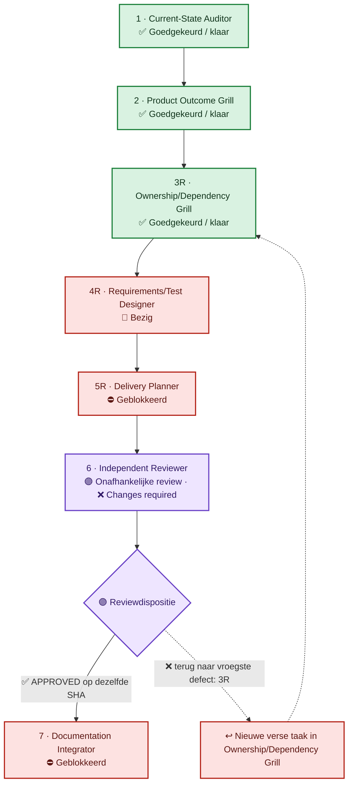

<!-- GENERATED from status.json by render.py. Do not edit this file directly. -->
# N1 BioForge Requirements Cockpit

> **🔵 Bezig — YOU ARE HERE** 
> Phase 4R C05 — verse requirementtaak actief 
> **Grens:** C01 t/m C04 zijn duurzaam gevalideerd; C05 is gestart vanaf de duurzame C04-handoff 
> **Wat de mens nu doet:** Geen actie nodig; de orchestrator stopt zelf bij een menselijke of gebruiksgrens. 
> **Volgende toegestane actie:** Valideer en commit alleen geldige C05-output; start daarna pas een verse C06-taak.

- Planning branch: `codex/release-1-reconciliation`
- Input-SHA: `092d1ee6225a71e1783ef6d22096d334b493ba7f`
- Snapshot: `2026-09-10`
- Scope: Planning and specification only; no application code, runtime, deployment, pull request, merge, or CT 240 action.

## Zeven fasen en teruglus

De hoofdlijn staat bewust verticaal met ruime afstand. Alleen de reviewbeslissing heeft een teruglus; requirementdetails staan in de tabel en kaarten zodat het diagram geen pijlenwirwar wordt.

## YOU ARE HERE en geplande chunkvolgorde

Chunk **`C05`** is actief. `C06` blijft de eerstvolgende kandidaat en mag pas na validatie starten. De roadmap gebruikt één verticale baan en toont de vaste dependencyvolgorde expliciet.

```mermaid
%%{init: {"flowchart": {"curve": "linear", "nodeSpacing": 55, "rankSpacing": 65, "htmlLabels": true}}}%%
flowchart TB
    %% One vertical lane: order is explicit and no dependency arrows cross.
    chunk_0["0 · C00<br/>Bewaarde S0-feiten beschermen tegen bewijsinflatie<br/>✅ Goedgekeurd / klaar"]
    chunk_1["1 · C01<br/>Eén gedeelde taal en een lokale identity-providerbasis<br/>✅ Goedgekeurd / klaar"]
    chunk_2["2 · C02<br/>Reproduceerbare proceswaarden zonder control logic in Simulation<br/>✅ Goedgekeurd / klaar"]
    chunk_3["3 · C03<br/>Eén echte REACT-fase met een vroege live Ignition-procesweergave<br/>✅ Goedgekeurd / klaar"]
    chunk_4["4 · C04<br/>Een ongeldige start server-side weigeren en begrijpelijk verklaren<br/>✅ Goedgekeurd / klaar"]
    chunk_5["5 · C05<br/>MES-schema rechtstreeks bewijzen en het daarna veilig toepassen en seeden<br/>🔵 Bezig"]
    chunk_6["6 · C06 · ⏭ VOLGENDE<br/>Order, identiteit, dispatch, outbox en een minimale read-only MES-workspace<br/>❌ Changes required"]
    chunk_7["7 · C07<br/>Duurzame history en audit combineren met afzonderlijke operatorauthority<br/>❌ Changes required"]
    chunk_8["8 · C08<br/>Kafka-businessfacts en ERP-projectie, met resilience alleen waar die gebruikt wordt<br/>❌ Changes required"]
    chunk_9["9 · C09<br/>Contextnavigatie en gedeelde sessie nadat beide applicaties lokaal werken<br/>❌ Changes required"]
    chunk_10["10 · C10<br/>Volledige controlflow, interlock, veilige degradatie en resterende UI-hardening<br/>❌ Changes required"]
    chunk_11["11 · C11<br/>Een niet-destructieve releasecandidate, kosteloosheidsbewijs en pas daarna reset en demo<br/>❌ Changes required"]
    chunk_12["12 · GATE<br/>Eén integraal en onafhankelijk goedgekeurd planningspakket<br/>⛔ Geblokkeerd"]
    current_marker["🔵 YOU ARE HERE<br/>C05<br/>Volgende: C06"]
    chunk_0 --> chunk_1 --> chunk_2 --> chunk_3 --> chunk_4 --> current_marker --> chunk_5 --> chunk_6 --> chunk_7 --> chunk_8 --> chunk_9 --> chunk_10 --> chunk_11 --> chunk_12
    classDef approved fill:#D9F2E1,stroke:#1B7F3A,color:#12351D,stroke-width:2px
    classDef inprogress fill:#DCEBFF,stroke:#2463A6,color:#12304F,stroke-width:2px
    classDef human fill:#FFF2BF,stroke:#A66B00,color:#4D3300,stroke-width:2px
    classDef changes fill:#FDE2E1,stroke:#B42318,color:#5D1712,stroke-width:2px
    classDef blocked fill:#FDE2E1,stroke:#B42318,color:#5D1712,stroke-width:2px
    classDef notstarted fill:#F2F4F7,stroke:#667085,color:#344054,stroke-width:2px
    classDef current fill:#DCEBFF,stroke:#2463A6,color:#12304F,stroke-width:3px
    class chunk_0 approved
    class chunk_1 approved
    class chunk_2 approved
    class chunk_3 approved
    class chunk_4 approved
    class chunk_5 inprogress
    class chunk_6 changes
    class chunk_7 changes
    class chunk_8 changes
    class chunk_9 changes
    class chunk_10 changes
    class chunk_11 changes
    class chunk_12 blocked
    class current_marker current
```

## Fasestatus

| Fase | Rol | Status | Betekenis nu |
|---|---|---|---|
| 1 | Current-State Auditor | ✅ Goedgekeurd / klaar |  |
| 2 | Product Outcome Grill | ✅ Goedgekeurd / klaar |  |
| 3R | Ownership/Dependency Grill | ✅ Goedgekeurd / klaar | Alleen de afgebakende Phase-3R-correctie is goedgekeurd; dit keurt Phase 4R, 5R, 6 of 7 niet goed. |
| 4R | Requirements/Test Designer | 🔵 Bezig | C01 t/m C04 zijn duurzaam gevalideerd; één verse C05-taak is actief. |
| 5R | Delivery Planner | ⛔ Geblokkeerd | Volledige regeneratie is pas toegestaan nadat de nieuwe Phase 4R is gevalideerd. |
| 6 | Independent Reviewer | ❌ Changes required | 06R blijft CHANGES REQUIRED. De 3R-correctie is uitgevoerd; 4R en 5R zijn nog niet opnieuw gegenereerd. |
| 7 | Documentation Integrator | ⛔ Geblokkeerd | Onmogelijk vóór een goedgekeurde Phase 6 op dezelfde planning-SHA. |

## Dependency-gedreven requirementchunks

| Volgorde | Chunk | Gewone-mensentaal | REQ-IDs of families | Status | Verantwoordelijke rol/taak | Volgende toegestane actie |
|---:|---|---|---|---|---|---|
| 0 | `C00` | Bewaarde S0-feiten beschermen tegen bewijsinflatie | `REQ-PLAT-001..024` `REQ-PLAT-028..033` | ✅ Goedgekeurd / klaar | Current-State Auditor Nog geen verse taak | Gebruik deze evidence alleen als voorganger; maak historische claims niet sterker. |
| 1 | `C01` | Eén gedeelde taal en een lokale identity-providerbasis | `REQ-CTR-001..030` `REQ-PLAT-063..064` `nieuw IdP-groundwork-ID door Phase 4R toe te kennen` | ✅ Goedgekeurd / klaar | Requirements/Test Designer phase4r-c01-20260909-01 | Behoud C01 als voorganger voor alle volgende chunks. |
| 2 | `C02` | Reproduceerbare proceswaarden zonder control logic in Simulation | `owner-local REQ-SIM-* basis` `REQ-SIM-021 opvolging met correcte identiteit en volledige failure-assertie` | ✅ Goedgekeurd / klaar | Requirements/Test Designer phase4r-c02-20260910-04 | Behoud C02 als voorganger; start daarna één verse C03-taak. |
| 3 | `C03` | Eén echte REACT-fase met een vroege live Ignition-procesweergave | `toepasselijke REQ-AUT-*` `eerste-fase REQ-BC-*` `row-specifieke live-view REQ-HMI-*` | ✅ Goedgekeurd / klaar | Requirements/Test Designer phase4r-c03-20260910-02 | Behoud C03 als voorganger; de volgende uitvoerder start na preflight één verse C04-taak. |
| 4 | `C04` | Een ongeldige start server-side weigeren en begrijpelijk verklaren | `permissive/reject-subset van REQ-BC-*` `bijbehorende process-eventcontracten` | ✅ Goedgekeurd / klaar | Requirements/Test Designer phase4r-c04-20260910-01 | Behoud C04 als voorganger; start daarna één verse C05-taak. |
| 5 | `C05` | MES-schema rechtstreeks bewijzen en het daarna veilig toepassen en seeden | `REQ-MES-036` `REQ-MES-038..041` `REQ-PLAT-025..027` `REQ-MES-037` | 🔵 Bezig | Requirements/Test Designer phase4r-c05-20260910-01 | Laat alleen de verse C05-taak de gedeclareerde private requirementsbestanden bijwerken en valideer daarna de volledige diff. |
| 6 | `C06` | Order, identiteit, dispatch, outbox en een minimale read-only MES-workspace | `toepasselijke REQ-MES-*` `ERP REST-ingress-subset` `row-specifieke read-only REQ-MUI-*` | ❌ Changes required | Requirements/Test Designer Nog geen verse taak | Splits schema, runtime, dispatch, outbox en minimale workspace op echte observable grenzen. |
| 7 | `C07` | Duurzame history en audit combineren met afzonderlijke operatorauthority | `persistence-subset REQ-MES-*` `manual-control REQ-BC-*` `action-subset REQ-HMI-*` | ❌ Changes required | Requirements/Test Designer Nog geen verse taak | Maak owner-local MES- en Batch-Control-bewijs vóór de afhankelijke HMI-actionrijen. |
| 8 | `C08` | Kafka-businessfacts en ERP-projectie, met resilience alleen waar die gebruikt wordt | `REQ-MES-042..045` `REQ-INT-*` `REQ-ERP-*` `uitsluitend backlog/replay-gerelateerde REQ-MUI-*` | ❌ Changes required | Requirements/Test Designer Nog geen verse taak | Plaats REQ-INT-004 bij de finale demo en geef elke UI-rij alleen gebruikte resilience-voorgangers. |
| 9 | `C09` | Contextnavigatie en gedeelde sessie nadat beide applicaties lokaal werken | `contextuele REQ-MUI-*` `contextuele REQ-HMI-*` `late REQ-PLAT-059` `nieuw owner-local auth-ID indien betekenis wijzigt` | ❌ Changes required | Requirements/Test Designer Nog geen verse taak | Ken eerst lokale auth/routes toe en verbind ze pas daarna in expliciete late verificatierijen. |
| 10 | `C10` | Volledige controlflow, interlock, veilige degradatie en resterende UI-hardening | `resterende REQ-AUT-*` `resterende REQ-SIM-*` `resterende REQ-BC-*` `REQ-MES-031` `row-local REQ-HMI/MUI-* hardening` | ❌ Changes required | Requirements/Test Designer Nog geen verse taak | Regeneer na de vroege owner-local chunks en houd failure modes expliciet en meetbaar. |
| 11 | `C11` | Een niet-destructieve releasecandidate, kosteloosheidsbewijs en pas daarna reset en demo | `REQ-INT-004` `final-gate REQ-PLAT-*` `EN-DEMO-READY-001` `EN-DEMO-001` | ❌ Changes required | Requirements/Test Designer Nog geen verse taak | Specificeer eerst de non-destructieve candidate; plan geen reset of Worker vóór goedgekeurde Phase 6 en voltooide Phase 7. |
| 12 | `GATE` | Eén integraal en onafhankelijk goedgekeurd planningspakket | `alle actieve Release-1-rijen` `traceability` `Phase-5R-plan` `Phase-7-adoptieprocedure` | ⛔ Geblokkeerd | Independent Reviewer Nog geen verse taak | Blijf geblokkeerd tot 4R en 5R volledig zijn geregenereerd; start daarna één verse onafhankelijke review. |

## Statuslegenda

- ✅ groen — goedgekeurd of klaar met duurzaam bewijs.
- 🔵 blauw — bezig, met precies één geregistreerde schrijver.
- 🟨 geel — wacht op een mens of keuze.
- ❌ of ⛔ rood — changes required of geblokkeerd.
- ⬜ grijs — niet gestart of uitgesteld.
- 🟣 paars — onafhankelijke review; de tekst vermeldt steeds de uitkomst.

## Cockpitregels

- Niets wordt groen zonder een duurzame evidence-link en SHA.
- Phase 7 is technisch geblokkeerd totdat Phase 6 dezelfde planning-SHA expliciet heeft goedgekeurd.
- De huidige Phase-6R-dispositie blijft **CHANGES REQUIRED**.
- Historische Phase 3/4/5 en review 6/6R blijven bestaan; de cockpit vat ze samen maar wist of herkleurt ze niet.
- Geen applicatiecode, runtime, deployment, PR, merge of CT 240-actie valt binnen deze cockpit.

## Orchestratorprotocol

1. Maak precies één verse taak per rol en chunk; combineer geen rollen in één taak.
2. Gebruik alleen duurzame, gecommitteerde input en registreer input-SHA en ref vóór de taak start.
3. Registreer taaklink, status, output/handoff en output-SHA terug in deze statusbron nadat de roltaak stopt.
4. Declareer vooraf de schrijfset; er mag nooit meer dan één actieve schrijver op hetzelfde bestand staan.
5. Bij CHANGES REQUIRED wijst return_to_phase naar de vroegste defecte fase en start daar een nieuwe verse taak.
6. Behoud iedere expliciete menselijke approval gate, vooral requirementidentiteit, Phase-7-adoptie en elke destructieve CT 240-handeling.
7. Worker, Reviewer en orchestrator mergen nooit automatisch; alleen een mens merge.
8. Chatgeschiedenis is nooit bewijs en mag niet als vervanging voor een duurzame handoff worden gebruikt.

## Kosteloos consulteren

- Deze Markdownpagina en Mermaid-flow zijn direct leesbaar in GitHub.
- De zelfstandige webcockpit staat op https://jandesch91.github.io/n1-bioforge-requirements-cockpit/.
- De publieke mirror bevat alleen cockpitartifacts; de N1 BioForge-bronrepository blijft privé.
